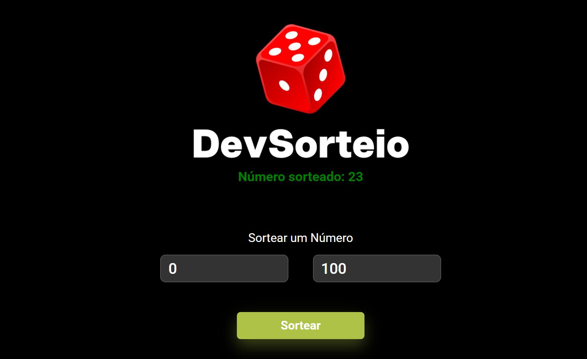

# 🧪 Sorteador de Números

App simples feito com **HTML**, **CSS** e **JavaScript** que sorteia um número entre dois valores informados.

Ideal pra treinar lógica básica, manipulação do DOM e interações com o usuário no front.

---

## ⚙️ Como funciona

1. Digita um valor mínimo e um valor máximo nos inputs.
2. Clica em **Sortear**.
3. O app gera um número aleatório entre os dois valores e exibe na tela.

---

## 🛠️ Stack
   

---
 ## 📷 Preview

                                                   

  

---
💡 Possíveis melhorias futuras
Implementar validação avançada dos campos (ex: tratar NaN, intervalos invertidos etc).

Adicionar feedback visual (loading ou animação ao sortear).

Permitir múltiplos sorteios com histórico.

Implementar modo escuro com toggle.

Deploy com GitHub Pages para facilitar o acesso.

---
🤝 Contribuições
Contribuições são bem-vindas!
Sinta-se à vontade para abrir uma issue para reportar bugs ou sugerir melhorias. Pull requests também são muito apreciados.

